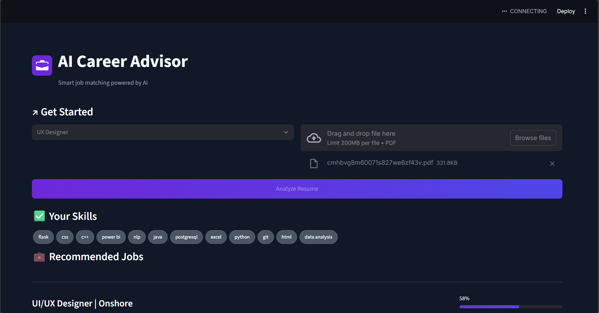

# AI Career Advisor

An end-to-end data science application that provides smart job matching and skill gap analysis, all wrapped in a professional, modern user interface. The tool scrapes job data, uses Natural Language Processing (NLP) to extract required skills, and compares them against a user's uploaded PDF resume to provide personalized recommendations.



## ✨ Features

* **Professional UI:** A clean, dark-themed interface inspired by modern web applications.
* **Dynamic Job Selection:** Users can select from multiple pre-loaded job categories (e.g., Data Scientist, Software Engineer).
* **Resume Parsing:** Automatically extracts text and skills from an uploaded PDF resume.
* **AI-Powered Recommendations:** Uses a TF-IDF Vectorizer and Cosine Similarity to calculate a match score and rank jobs based on skill overlap.
* **Detailed Skill Gap Analysis:** Clearly visualizes which skills the user has ("Matching Skills") and which they are missing ("Missing Skills") for the top-ranked job, along with an overall skill completeness score.

## 🛠️ Tech Stack

* **Data Acquisition:** `SerpApi` for reliable scraping of Google Jobs.
* **Data Processing:** `Pandas`, `NumPy`.
* **NLP & AI:** `spaCy` for linguistic processing and `Scikit-learn` for TF-IDF vectorization and cosine similarity.
* **PDF Parsing:** `PyMuPDF`.
* **Web Framework & UI:** `Streamlit` with custom `CSS` for styling.

## 🚀 How to Run Locally

Follow these steps to set up and run the project on your own machine.

### 1. Clone the Repository

```bash
git clone https://github.com/your-username/AI-Job-Recommender.git
cd AI-Job-Recommender
# Replace your-username with your GitHub username
```

### 2. Create and Activate a Virtual Environment

It is highly recommended to use a virtual environment to manage project dependencies.

```bash
# Create the environment
python -m venv venv

# Activate on Windows
venv\Scripts\activate

# Activate on macOS/Linux
source venv/bin/activate
```

### 3. Install Dependencies

Install all the required libraries from the `requirements.txt` file.

```bash
pip install -r requirements.txt
```

### 4. Download spaCy Model

The project's NLP component requires the large English model from spaCy.

```bash
python -m spacy download en_core_web_lg
```

### 5. Launch the Application

Run the Streamlit app from your terminal.

```bash
streamlit run app.py
```

Your web browser should automatically open a new tab with the application running.

## 📂 Project Structure

```
.
├── app.py                  # The main Streamlit web application
├── style.css               # Custom CSS for the professional UI
├── requirements.txt        # List of all Python dependencies
├── skills.txt              # The master dictionary of skills for the NLP model
├── jobs_with_skills.csv    # The processed and enriched data file
└── sample_resume.pdf       # A sample resume for testing
```

---
